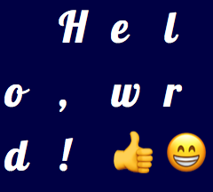

*Warning: This is pre-release, experimental software!*

**dynotype** is a specialized sprite sheet generator and typesetter, designed to feed bitmap text rendering systems. This module is not capable of rendering text on its own, and should be paired with [loopin-dynotype](https://github.com/koopero/loopin-dynotype).


# Quick Walkthrough

Given the following configuration file ...

``` yaml
# Name of the font sheet. This will be used for yaml, png and html file.
name: hello-example

# Glyphs to include in the sheet.
glyphs: Hello, world! 👍 😁
size: 48
fonts: 
  - family: 'Lobster'
    # CSS for individual fonts needs a bit of tweaking.
    css: |
      top: 6px;
      left: 6px;

# Set the background. In real-world usage, 
# transparent would better,
# but this will show up in markdown.
css: |
  body {
    background: #004
  }  
```

... and running from the command line ...

``` sh
dynotype example/hello.yaml
```

... dynotype will produce this image ...



... along with metadata describing the sprite sheet. The sheet can now be loaded in javascript and typeset.

``` js
const Dynotype = require('dynotype')
const dyno = new Dynotype()
await dyno.load('hello-example.yaml')

let line = dyno.line('Hello, world!')
// `line` will now contain placement of each
// glyph of the string above, using actual 
// character widths!
```

# Installation

`dynotype` should be installed globally for command line use.

[PhantomJS](http://phantomjs.org/download.html) is required for sheet generation.

The following is for **OSX**, using the [Homebrew](https://brew.sh/) package manager.

``` sh
brew install phantomjs
npm install -g dynotype
```


# Future
- **More thorough documentation.**
- Publishing of downstream modules.
- Support for icon libraries [font-awesome](https://fontawesome.com/) and [weathericons](https://erikflowers.github.io/weather-icons/).
- Text rendering.
- More advanced typesetting.
- Support for images.

# Thanks

Development of `dynotype`, as well as other interesting, open source creative coding software, is supported by [HFour](https://hfour.ca/).